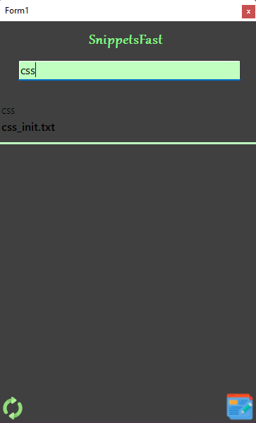
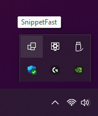
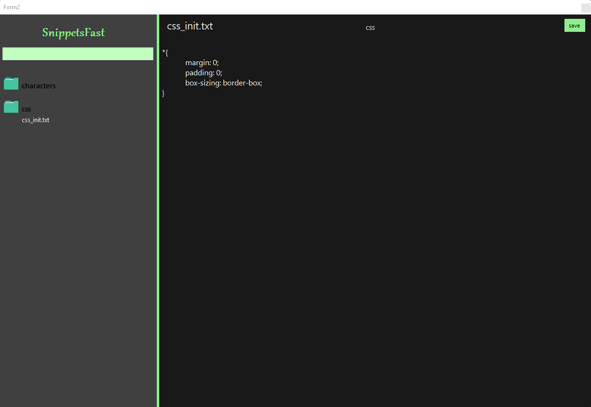
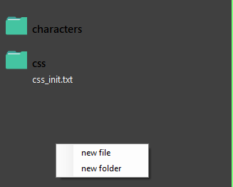
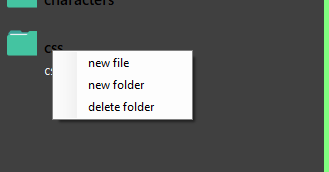
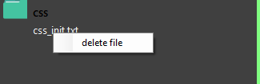

# SnippetsFast

this is my first C# project while i'm learning it, this program allows you to search and copy your snippets quickly, i was inspired by a program that exists on macOS.

## Usage
This program creates and uses a folder in Documents called "SnippetsFast", all text files(snippets) wil go inside it.
 

### **Main window**

In the first window you can search, if you press ENTER you copy first snippet then the window goes in notification area.
 

There are two icon at the bottom
 

 
left icon rescan all snippets (if you add or remove files/folders manually you can use this icon insted restarting the program), right icon opens the editor window.

### **Editor Window**
In this window you can create, modify and delte files.

Using right mouse button one left side you can create files, folders and delete them, just write the name, automatically the program saves the file with .txt extension.
  

### right click on background(main folder)

### right click on folders

### right click on files
